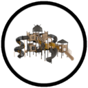

    

<h1 align="center">Organisation Logo Catalogue</h1>

This catalogue provides a visual index of every official GitHub organisation within **The Lupaxa Project** ecosystem together with the branding assets available
for each organisation.

The catalogue serves as the primary reference when locating organisation logos for repositories, documentation, websites, presentations, and other project
resources.

Each organisation currently provides the standard asset set:

| Asset                  | Purpose                                                                          |
| :--------------------- | :------------------------------------------------------------------------------- |
| `readme-logo.png`      | Standard logo displayed at the top of repository README files.                   |
| `logo-raw.png`         | Raw transparent logo used as the starting point for all assets.                  |
| `logo-transparent.png` | Primary transparent logo suitable for documentation, websites and presentations. |
| `logo-white.png`       | White logo variant designed for dark backgrounds.                                |

## Organisation Catalogue

| Organisation                 | Preview                                                                                                            | Organisation          | Preview                                                                                                  | Organisation          | Preview                                                                                                  |
| :--------------------------- | :----------------------------------------------------------------------------------------------------------------: | :-------------------- | :------------------------------------------------------------------------------------------------------: | :-------------------- | :------------------------------------------------------------------------------------------------------: |
| Actions Toolbox              |                        | API Extractor Toolbox |  | AWS Toolbox           |                      |
| Azure Toolbox                |                            | CI/CD Toolbox         |                   | Code Playground       |              |
| Database Toolbox             |                      | Developers Toolbox    |        | DevOps Toolbox        |                |
| Docker Toolbox               |                          | GCP Toolbox           |                      | Git Toolbox           |                      |
| Git Hooks Toolbox            |                    | GitHub Toolbox        |                    | Monitoring Toolbox    |        |
| Notifications Toolbox        |            | Security Toolbox      |            | Spider Toolbox        |                |
| SRE Toolbox                  |                                | Terraform Toolbox     |          | The Lupaxa Blueprints |  |
| The Lupaxa Internal Toolbox  |           | The Lupaxa Lab        |                | The Lupaxa Project    |        |
| The Lupaxa Project (Private) |  |                       |                                                                                                          |                       |                                                                                                          |

