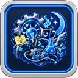
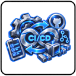

    

<h1 align="center">Organisation Logo Catalogue</h1>

This catalogue provides a visual index of every official GitHub organisation within **The Lupaxa Project** ecosystem together with the branding assets available
for each organisation.

The catalogue serves as the primary reference when locating organisation logos for repositories, documentation, websites, presentations, and other project
resources.

Each organisation currently provides the standard asset set:

| Asset                        | Purpose                                                        |
| :--------------------------- | :------------------------------------------------------------- |
| `readme-logo.png`            | Standard logo displayed at the top of repository README files. |
| `favicon.png`                | Standard favicon used for websites.                            |
| `github-profile-picture.png` | Standard favicon used for websites.                            |
| `reference/*.png`            | Raw logos used as the starting point for all assets.           |
| `logos/*.png`                | Set of standard sized logos with a white background.           |

## Open Source Catalogue

| Organisation          |                                                 Preview                                                 | Organisation       |                                              Preview                                              | Organisation          |                                                 Preview                                                 |
| :-------------------- | :-----------------------------------------------------------------------------------------------------: | :----------------- | :-----------------------------------------------------------------------------------------------: | :-------------------- | :-----------------------------------------------------------------------------------------------------: |
| Actions Toolbox       |              | After Hours        |                | AI Toolbox            |                        |
| API Extractor Toolbox |  | AWS Toolbox        |                | CI/CD Toolbox         |                   |
| Database Toolbox      |            | Developers Toolbox |  | Docker Toolbox        |                |
| Git Hooks Toolbox     |          | Git Toolbox        |                | GitHub Toolbox        |                    |
| Miscellaneous Toolbox |  | Monitoring Toolbox |  | Notifications Toolbox |  |
| Security Toolbox      |            | Spider Toolbox     |          | SRE Toolbox           |                      |
| Workstation Toolbox   |      |                    |                                                                                                   |                       |                                                                                                         |

## Organisation Catalogue

| Organisation          | Preview                                                                                                 | Organisation                 | Preview                                                                                                           | Organisation   | Preview                                                                                   |
| :-------------------- | :-----------------------------------------------------------------------------------------------------: | :--------------------------- | :---------------------------------------------------------------------------------------------------------------: | :------------- | :---------------------------------------------------------------------------------------: |
| The Lupaxa Blueprints |  | The Lupaxa Internal Toolbox  |           | The Lupaxa Lab |  |
| The Lupaxa Project    |        | The Lupaxa Project (Private) |  |                |                                                                                           |

